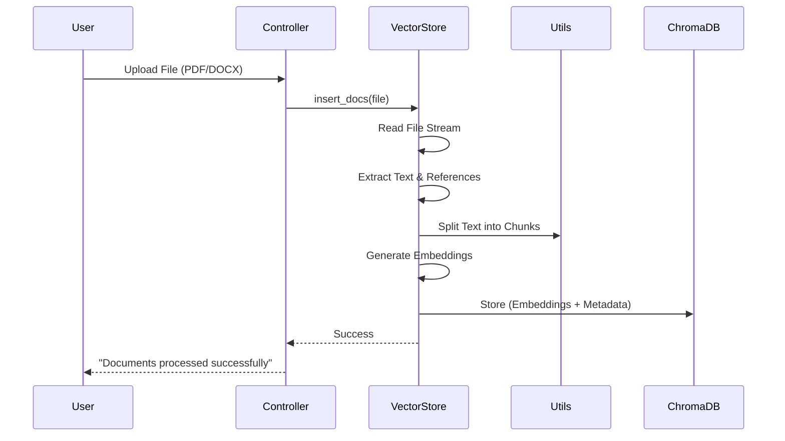

# ResilienceGPT 🤖🌍

**ResilienceGPT** is an advanced, AI-powered conversational assistant specialized in **Disaster Management**. It leverages Retrieval-Augmented Generation (RAG) to provide accurate, academically cited responses based on a vast corpus of disaster-related documents (PDFs, DOCX, etc.).

Beyond text, ResilienceGPT is **multi-modal**, capable of processing voice commands and generating relevant imagery using Stable Diffusion to aid in visualization.

---

## 🚀 Key Features

* **📚 RAG-Based Knowledge**: Ingests custom documents to answer queries with strict academic citations (IEEE style).
* **🧠 Local LLM Inference**: Powered by **Ollama (Llama 3.1)** for privacy and offline capability.
* **🎙️ Voice Interaction**: Integrated **Whisper AI** for accurate speech-to-text transcription.
* **🎨 AI Image Generation**: Generates visual representations of disaster scenarios using **Stable Diffusion**.
* **⚡ Optimized Architecture**:
  * **Vector Search**: ChromaDB for efficient similarity search.
  * **Parallel Processing**: Concurrent summarization for handling long documents.
  * **SQLite History**: Persistent conversation tracking.

---

## 🏗️ System Architecture

The application follows a modular architecture separating the frontend (Flask), controllers, and specialized backend services.

```mermaid
graph TD
    User[User / Client] -->|HTTP Request| App[Flask App]
    App -->|Route Logic| Controller[Controllers]
    
    subgraph Services
        Controller -->|Query/Insert| VS[VectorStore Service]
        Controller -->|Generate/Summarize| LLM[LLM Service]
        Controller -->|Transcribe| Speech[Speech Service]
        Controller -->|Persist Chat| DB[(SQLite Database)]
    end
    
    subgraph External_AI
        VS -->|Embeddings| Chroma[(ChromaDB)]
        LLM -->|Chat/Completion| Ollama[Ollama (Llama 3.1)]
        LLM -->|Image Gen| SD[Stable Diffusion]
    end
```

---

## 🔄 Workflows & Dataflows

### 1. Document Ingestion Pipeline

When a user uploads a document (PDF, TXT, DOCX), it goes through a rigorous processing pipeline to ensure accurate retrieval later.



### 2. Retrieval Retrieval-Augmented Generation (RAG) Flow

The core answering mechanism involves retrieving relevant context before asking the LLM.

```mermaid
flowchart LR
    Q[User Query] --> Embed[Embedding Model]
    Embed --> Vec[Vector Query]
    Vec -->|Search| Chroma[(ChromaDB)]
    Chroma -->|Top-k Chunks| Context[Context Aggregation]
    
    Context --> Prompt[Construction Prompt]
    ChatHist[Chat History] --> Prompt
    
    Prompt --> LLM[Ollama (Llama 3.1)]
    LLM --> Response[Academic Response]
```

---

## 🛠️ Installation & Setup

### Prerequisites

* Python 3.10+
* [Ollama](https://ollama.com/) installed and running (`llama3.1` model pulled)
* NVIDIA GPU (Recommended for Stable Diffusion)

### 1. Clone the Repository

```bash
git clone https://github.com/your-repo/resiliencegpt.git
cd resiliencegpt
```

### 2. Install uv (if not installed)

```bash
# Windows
powershell -c "irm https://astral.sh/uv/install.ps1 | iex"
# Linux/Mac
curl -LsSf https://astral.sh/uv/install.sh | sh
```

### 3. Sync Dependencies

```bash
uv sync
```

### 4. Configure Environment

Rename `.env.example` to `.env` and configure accordingly:

```ini
SECRET_KEY=your_secure_secret_key
OLLAMA_BASE_URL=http://localhost:11434
OLLAMA_MODEL=llama3.1
DATABASE_PATH=chat_history.db
CHROMA_DB_PATH=chroma_local_db
```

### 5. Run the Application

```bash
uv run app.py
```

Access the application at `http://localhost:5002`.

---

## 📂 Project Structure

```text
ResilienceGPT/
├── app.py                  # Main Flask Entry Point
├── controllers.py          # Business Logic & Orchestration
├── config.py               # Application Configuration
├── services/               # Core Services
│   ├── database.py         # SQLite Conversation Management
│   ├── llm_service.py      # Ollama & Stable Diffusion Logic
│   ├── vector_store.py     # RAG & ChromaDB Management
│   └── speech_service.py   # Whisper AI Transcription
├── utils/
│   └── text_processing.py  # Reference Extraction & Chunking
├── tests/                  # Smoke Tests
├── static/                 # CSS/JS Assets
└── templates/              # HTML Templates
```
